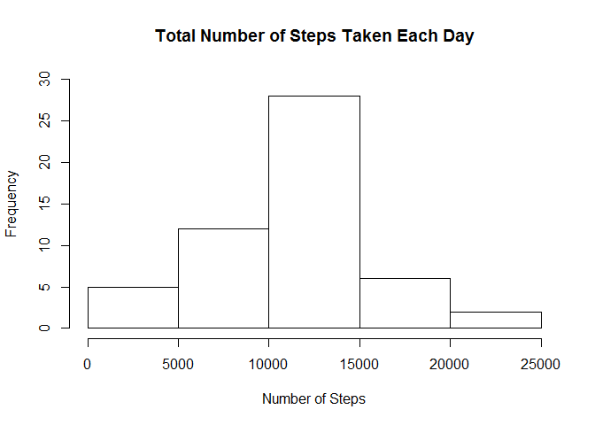
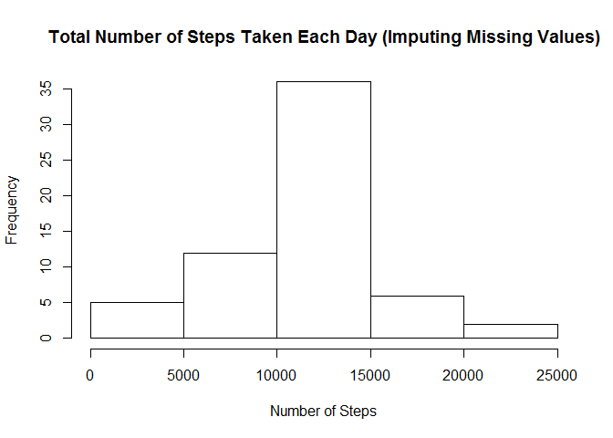
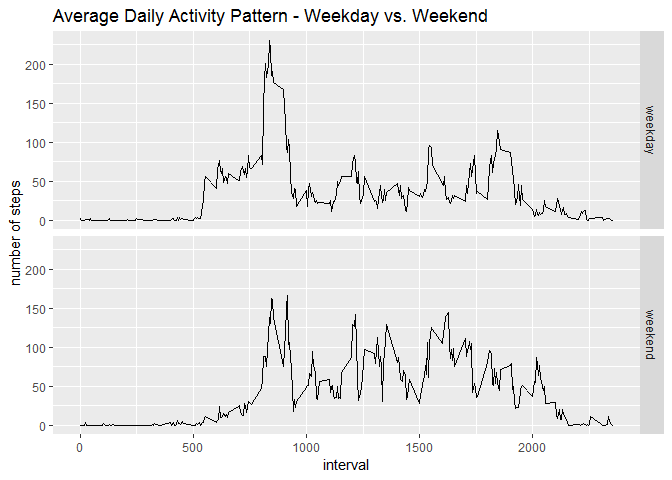

## Loading and preprocessing the data


```r
library(dplyr)
library(ggplot2)
data <- read.csv('activity.csv')
```

## What is mean total number of steps taken per day?

```r
total <- group_by(data, date) %>% summarise(total = sum(steps))
total_mean <- mean(total$total, na.rm = TRUE)
total_median <- median(total$total, na.rm = TRUE)
hist(total$total, main = 'Total Number of Steps Taken Each Day', xlab = 'Number of Steps', ylim = c(0,30))
```

<!-- -->

The mean total number of steps taken per day is 10766.19.
The median total number of steps taken per day is 10765.

## What is the average daily activity pattern?

```r
average <- group_by(data, interval) %>% summarise(average = mean(steps, na.rm = TRUE))
index <- which.max(average$average)
t <- average[index,1]
plot(average$interval, average$average, type = 'l', xlab = 'Interval', ylab = 'Number of Steps', main = 'Average Daily Activity Pattern')
```

<!-- -->

Interval 835 contains the maximum number of steps.

## Imputing missing values

```r
n <- sum(is.na(data$steps))
data1 <- data
for (i in 1:nrow(data1)){
    if (is.na(data1[i,1])) {
        idx <- which(data1[i,3]==average$interval)
        data1[i,1] <- average[idx,2]
    }
}
total1 <- group_by(data1, date) %>% summarise(total1 = sum(steps))
total1_mean <- mean(total1$total1)
total1_median <- median(total1$total1)
hist(total1$total1, main = 'Total Number of Steps Taken Each Day (Imputing Missing Values)', xlab = 'Number of Steps')
```

<!-- -->

The total number of missing values in the dataset is 2304.
The mean total number of steps taken per day is 10766.19.
The median total number of steps taken per day is 10766.19.
These values do not differ from the estimates from the first part of the assignment.
Imputing missing data increases the frequency of the 10000-15000 steps, which is the group that the mean value belongs to. 


## Are there differences in activity patterns between weekdays and weekends?

```r
data1$week <- weekdays(as.Date(data1$date))
for (i in 1:nrow(data1)){
    if (data1[i,4]=='Saturday' | data1[i,4]=='Sunday') data1[i,4] <- 'weekend'
    else data1[i,4] <- 'weekday'
}
average1 <- group_by(data1, week, interval) %>% summarise(average1 = mean(steps))
qplot(interval, average1, data = average1, facets = week ~ ., geom = 'line', ylab = 'number of steps', main = 'Average Daily Activity Pattern - Weekday vs. Weekend')
```

<!-- -->

